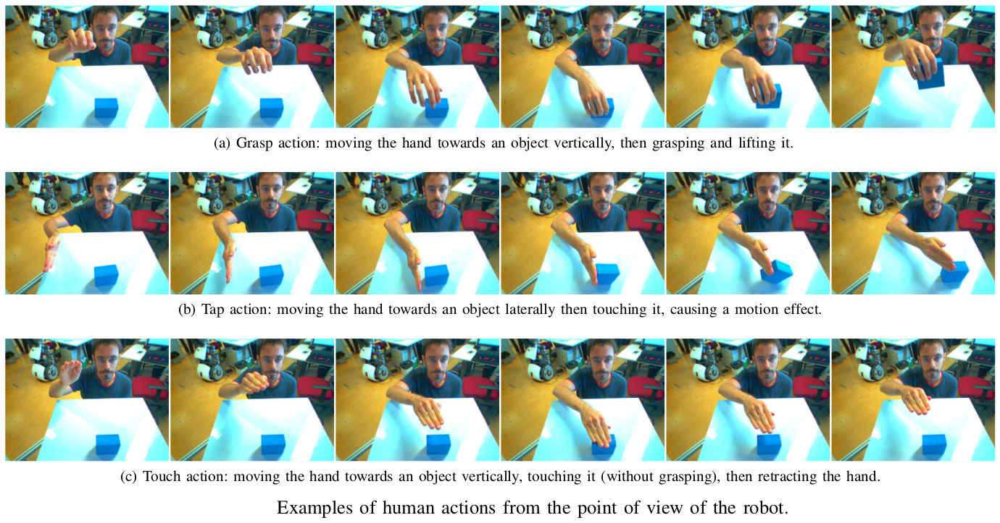
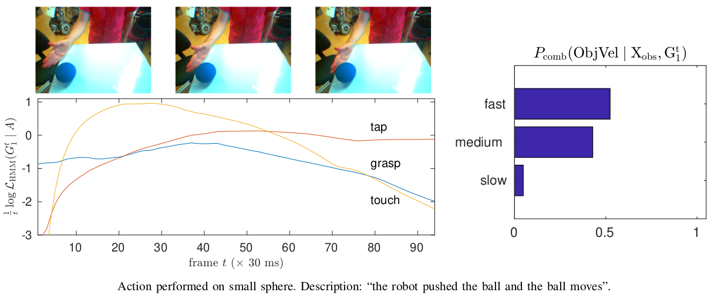

# tcds-gestures
This repository contains code and material for this paper:

* Giovanni Saponaro, Lorenzo Jamone, Alexandre Bernardino and Giampiero Salvi. Beyond the Self: Using Grounded Affordances to Interpret and Describe Others' Actions. IEEE Transactions on Cognitive and Developmental Systems, 2018 (accepted).

If this work is useful for your research, please kindly cite that paper.

## Description

We propose a developmental approach that allows a robot to interpret and describe the actions of human agents by reusing previous experience.
The robot first learns the association between words and object affordances by manipulating the objects in its environment.
It then uses this information to learn a mapping between its own actions and those performed by a human in a shared environment (see figure below).
It finally fuses the information from these two models to interpret and describe human actions in light of its own experience.



In our experiments, we show that the model can be used flexibly to do inference on different aspects of the scene.
We can predict the effects of an action on the basis of object properties.
We can revise the belief that a certain action occurred, given the observed effects of the human action.
In an early action recognition fashion, we can anticipate the effects when the action has only been partially observed (see figure below).
By estimating the probability of words given the evidence and feeding them into a pre-defined grammar, we can generate relevant descriptions of the scene.



In this repository, we provide MATLAB code to use our model.
We hope that this is a step towards providing robots with the fundamental skills to engage in social collaboration with humans.

If you have any questions, please let us know by filing an issue.

## Installation

### Dependencies

* MATLAB
* FullBNT
* [AffordancesAndSpeech](https://github.com/giampierosalvi/AffordancesAndSpeech)

### Linux instructions

First, clone this repository:

```bash
git clone https://github.com/gsaponaro/tcds-gestures.git
cd tcds-gestures
```

Second, install FullBNT to `~/matlab/toolbox` and apply the patch that we provide:

```bash
mkdir ~/matlab
mkdir ~/matlab/toolbox
unzip 3rdparty/FullBNT-1.0.4.zip -d ~/matlab/toolbox
patch ~/matlab/toolbox/FullBNT-1.0.4/HMM/fwdback.m < extern/FullBNT/fwdback.patch
```

Third, clone [AffordancesAndSpeech](https://github.com/giampierosalvi/AffordancesAndSpeech) to a location that can be found by our file `configurePaths.m`. Currently, this can be `~/NOBACKUP` or `~/Documents`. For example:

```bash
cd ~/Documents
git clone https://github.com/giampierosalvi/AffordancesAndSpeech.git
```

## License

Released under the terms of the GPL v3.0 or later. See the file LICENSE for details.
